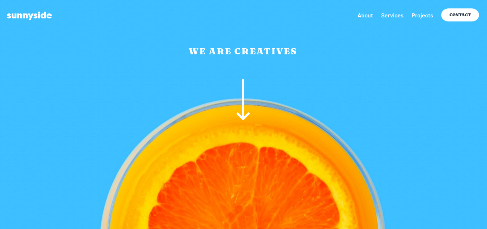

# Sunnyside Agency Landing Page
This is a solution to the [Sunnyside agency landing page challenge on Frontend Mentor](https://www.frontendmentor.io/challenges/sunnyside-agency-landing-page-7yVs3B6ef).

### Table of contents

- [Overview](#overview)
  - [The challenge](#the-challenge)
  - [Screenshot](#screenshot)
  - [Links](#links)
  - [Built with](#built-with)
- [Author](#author)

## Overview
### The challenge
Users should be able to:
- View the optimal layout for the site depending on their device's screen size
- See hover states for all interactive elements on the page

### Screenshot

### Links
- [Solution URL](https://github.com/w3bdev1/landing-sunnyside)
- [Live Site URL](https://w3bdev1.github.io/landing-sunnyside/)

### Built with
- Semantic HTML5 markup
- CSS custom properties
- Flexbox
- CSS Grid
- Mobile-first workflow

## Author
- Sudeep Biswas
- Frontend Mentor - [@w3bdev1](https://www.frontendmentor.io/profile/w3bdev1)
- Twitter - [@w3bdev1](https://www.twitter.com/w3bdev1)
